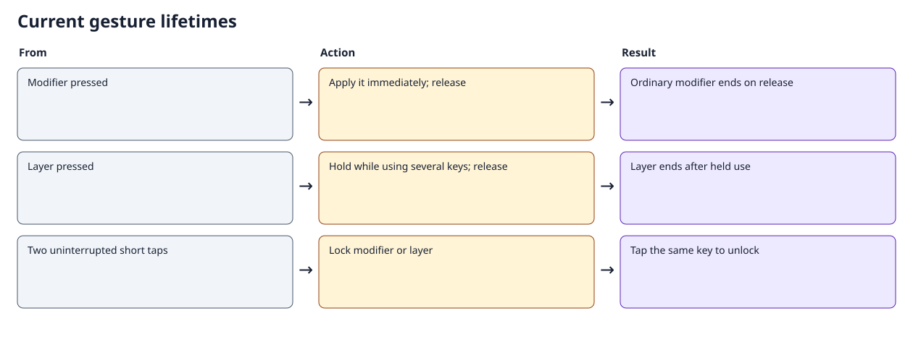
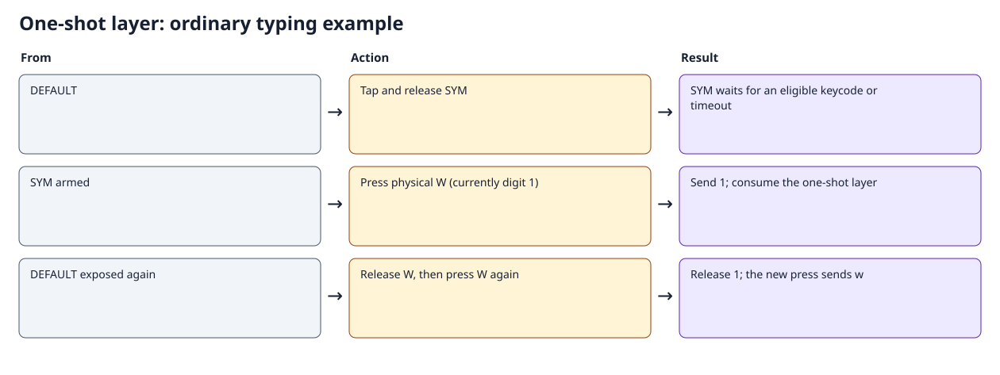
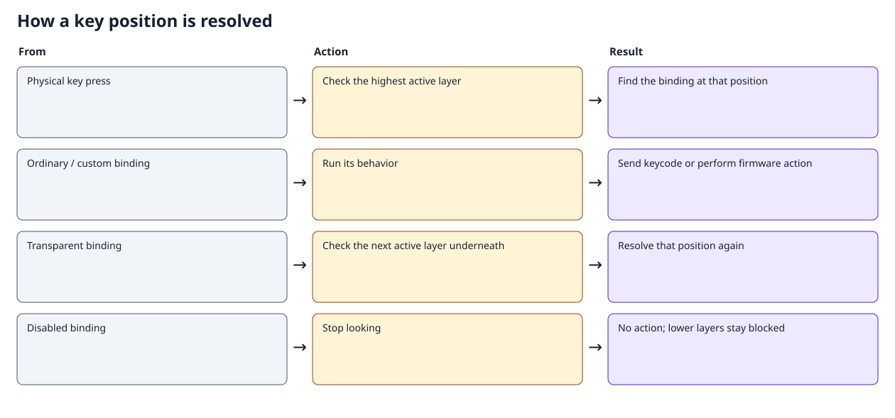
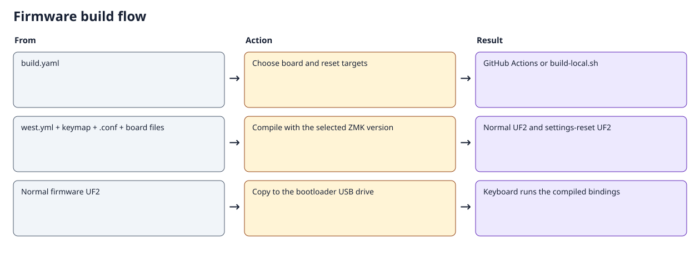

# BBQ10 Pro: keyboard guide

<!-- Generated by docs/generate_docs.py. Edit docs/templates/keyboard-guide.md.in. -->

This guide describes the current source configuration, built with ZMK **v0.3.0**. The [interactive keymaps](keymaps.html) show every position and exact binding. Physical labels identify the keycap; its action can differ from that label. Symbols assume a US host keyboard layout.

## Everyday controls

| What you want | Press |
| --- | --- |
| Tab | Physical **$** |
| Dollar sign | **SYM + $**, or tap SYM, then $ |
| Escape | **Right aA / ↑ (UPPER) + Backspace**, or tap UPPER, then Backspace |
| Command+Tab | Hold physical **0 (Command)** and press **$ (Tab)**; add Shift to reverse |
| Command+period | Hold **Command + SYM**, then **M**; either modifier press order works |
| Shift | Physical **Alt** at position 27 |
| Control | Bottom-left **aA** at position 37 |
| Alt | Physical **0** on UPPER |
| Bootloader / USB–Bluetooth output | On UPPER, tap **$** once for bootloader; twice for output toggle |
| Mute / MEDIA | On UPPER, tap **E** once to mute; twice to enter MEDIA |

The bottom-right key is dedicated to UPPER. Tab is directly accessible on the base layer's physical dollar key. Escape and dollar can each be entered as two sequential presses with one finger; simultaneous holding is optional.

Command+period is an application shortcut. Some applications interpret it as Cancel; it does **not** send the Escape keycode. UPPER+Backspace sends actual Escape.

The DEFAULT navigation row is **Left, Down, click, Up, Right**, retaining the requested Vim-oriented up/down reversal. SYM's shoulder buttons scroll down on the left and up on the right; UPPER retains its opposite shoulder directions.

## Tap, hold, and double tap

| Key class | Single tap | Hold | Double tap | Unlock |
| --- | --- | --- | --- | --- |
| Shift, Ctrl, Alt, Command | Ordinary modifier pulse | Immediate modifier, active until release | Lock across multiple keys | Tap the same modifier |
| SYM and UPPER | One-shot layer for the next eligible key | Immediate layer, active throughout the chord | Lock across multiple keys | Tap the same layer key |

A modifier lock has no idle timeout. Modifier locks combine independently: locking Shift and Command produces Shift+Command until each is unlocked. A long ordinary hold never becomes a lock. A single modifier tap does not arm the next letter.

Modifier double taps have a **250 ms** window; layer double taps have a **400 ms** window. Both are measured from the first press to the second press. Another physical key between taps cancels double-tap recognition. A layer change also cancels pending modifier double taps. The first press activates immediately, so holding a modifier or layer does not wait for the double-tap window.

A released, unused layer tap waits **3000 ms** for an eligible key. Modifier keys do not consume it; an ordinary keyboard key does. Firmware-only and mouse actions may leave it armed until the timer expires. An unused layer hold of **400 ms** or longer ends on release; a shorter unused press counts as a tap. Tapping an active one-shot after the double-tap window cancels it.



### Examples

- **One symbol:** tap SYM, release it, then press W to type `1`. The next W types `w`.
- **Several symbols:** hold SYM while typing them, then release SYM. No minimum hold duration is needed before typing.
- **Locked symbols:** double-tap SYM, type several symbols, then tap SYM to exit.
- **One-finger Escape:** tap the bottom-right UPPER key, release it, then press Backspace within the one-shot timeout.
- **Held shortcut:** hold Ctrl and Command together, press a letter, then release the modifiers independently.
- **Locked shortcut:** double-tap Command, press several shortcut keys, then tap Command to unlock.



### SYM in modifier chords

On DEFAULT, physical **0** is Command. While SYM is physically held, that position also remains Command, so both Command→SYM→M and SYM→Command→M produce Command+period. The selected action receives its matching release even when SYM is released first.

After a single SYM tap, or while SYM is double-tap locked, physical **0** types digit `0`. To combine a locked SYM layer with Command, hold or lock Command before entering SYM.

### Nested layers

UPPER is independently accessible from DEFAULT. If SYM is held or locked, UPPER can sit above it. Releasing one held layer preserves the other; exiting or consuming UPPER returns to a still-held or locked SYM. Explicitly tapping SYM to exit also exits its active UPPER child. Entering UPPER replaces a released one-shot SYM so its old expiry cannot unexpectedly cancel UPPER.

MEDIA remains a mostly disabled placeholder. Physical `$`, SYM, and right aA return to DEFAULT from MEDIA. Gesture locks do not survive a reboot.

### What “tap dance” means

A tap dance chooses an action by counting presses within a time window. The remaining built-in dances handle device actions: UPPER trackpad is click / clear the selected Bluetooth pairing; UPPER `$` is bootloader / output toggle; UPPER E is mute / MEDIA. Their single action may wait while a second tap remains possible.

The modifier and layer keys use dedicated gesture implementations so their first press is immediate. Double tap changes whether release leaves the modifier or layer locked. This provides the requested double-tap lock and ordinary held-key behavior without delaying an isolated modifier press.

## Current layer maps

| Number | Constant | Node |
| --- | --- | --- |
| 0 | DEFAULT | `default_layer` |
| 1 | SYM | `sym_layer` |
| 2 | UPPER | `upper_layer` |
| 3 | MEDIA | `media_layer` |

The highest-numbered active layer supplies the binding at each position. `&trans` falls through to lower layers; `&none` blocks the position. A held key receives its matching release even if the active layer changes before release.



### Layer 0: DEFAULT


42 positions; 0 disabled. [All exact bindings and explanations](keymaps.md).

| Physical position | Binding | What it does |
| --- | --- | --- |
| Backspace (26) | `&kp BSPC` | Press Backspace; release when the physical key is released. |
| Alt (27) | `&mod_shift` | Press Shift immediately; an ordinary hold ends on release. Double-tap within 250 ms (first press to second press) to lock it across multiple keys. Tap the same modifier again to unlock. Another key or layer change between taps cancels double-tap recognition. Locks can combine and have no unused timeout; they reset on reboot. |
| $ (35) | `&kp TAB` | Press Tab; release when the physical key is released. |
| aA left (37) | `&mod_ctrl` | Press Control immediately; an ordinary hold ends on release. Double-tap within 250 ms (first press to second press) to lock it across multiple keys. Tap the same modifier again to unlock. Another key or layer change between taps cancels double-tap recognition. Locks can combine and have no unused timeout; they reset on reboot. |
| 0 (38) | `&mod_gui` | Press Command / GUI immediately; an ordinary hold ends on release. Double-tap within 250 ms (first press to second press) to lock it across multiple keys. Tap the same modifier again to unlock. Another key or layer change between taps cancels double-tap recognition. Locks can combine and have no unused timeout; they reset on reboot. |
| SYM (40) | `&sym_key` | Tap for one use of SYM; hold to use it for the entire chord, then release to exit. Double-tap within 400 ms to lock it; tap again to exit it and its locked child layer. Holding never locks. An unused hold of 400 ms or longer exits on release. A released one-shot expires unused after 3000 ms. Modifiers do not consume it. Another physical key between taps cancels double-tap recognition. |
| aA right (41) | `&upper_key` | Tap for one use of UPPER; hold to use it for the entire chord, then release to exit. Double-tap within 400 ms to lock it; tap again to exit it and its locked child layer. Holding never locks. An unused hold of 400 ms or longer exits on release. A released one-shot expires unused after 3000 ms. Modifiers do not consume it. Another physical key between taps cancels double-tap recognition. |

### Layer 1: SYM


42 positions; 0 disabled. [All exact bindings and explanations](keymaps.md).

| Physical position | Binding | What it does |
| --- | --- | --- |
| Trackpad (4) | `&mkp LCLK` | Hold the left mouse button while pressed. |
| E (9) | `&kp N2` | Press 2; release when the physical key is released. |
| Backspace (26) | `&kp DEL` | Press Delete; release when the physical key is released. |
| $ (35) | `&kp DLLR` | Press $; release when the physical key is released. |
| 0 (38) | `&sym_command` | While SYM is physically held: Press Command / GUI immediately; an ordinary hold ends on release. Double-tap within 250 ms (first press to second press) to lock it across multiple keys. Tap the same modifier again to unlock. Another key or layer change between taps cancels double-tap recognition. Locks can combine and have no unused timeout; they reset on reboot. With a released one-shot or locked SYM: Press 0; release when the physical key is released. The selected action receives its matching release even if the layer ends first. |
| SYM (40) | `&sym_key` | Tap for one use of SYM; hold to use it for the entire chord, then release to exit. Double-tap within 400 ms to lock it; tap again to exit it and its locked child layer. Holding never locks. An unused hold of 400 ms or longer exits on release. A released one-shot expires unused after 3000 ms. Modifiers do not consume it. Another physical key between taps cancels double-tap recognition. |
| aA right (41) | `&upper_key` | Tap for one use of UPPER; hold to use it for the entire chord, then release to exit. Double-tap within 400 ms to lock it; tap again to exit it and its locked child layer. Holding never locks. An unused hold of 400 ms or longer exits on release. A released one-shot expires unused after 3000 ms. Modifiers do not consume it. Another physical key between taps cancels double-tap recognition. |

### Layer 2: UPPER


42 positions; 5 disabled. [All exact bindings and explanations](keymaps.md).

| Physical position | Binding | What it does |
| --- | --- | --- |
| Trackpad (4) | `&td0` | 1 press(es): Hold the left mouse button while pressed. 2 press(es): Erase the selected Bluetooth profile pairing. Dance interval: 400 ms. |
| E (9) | `&tdc_to_MEDIA` | 1 press(es): Press Mute; release when the physical key is released. 2 press(es): Switch to MEDIA; clear other nondefault layers. Releasing this key does not undo the switch. Dance interval: 400 ms. |
| Backspace (26) | `&kp ESC` | Press Escape; release when the physical key is released. |
| $ (35) | `&td_boot_out` | 1 press(es): Enter the bootloader for firmware flashing. 2 press(es): Toggle preferred USB/Bluetooth output. Dance interval: 400 ms. |
| 0 (38) | `&mod_alt` | Press Alt immediately; an ordinary hold ends on release. Double-tap within 250 ms (first press to second press) to lock it across multiple keys. Tap the same modifier again to unlock. Another key or layer change between taps cancels double-tap recognition. Locks can combine and have no unused timeout; they reset on reboot. |
| SYM (40) | `&sym_key` | Tap for one use of SYM; hold to use it for the entire chord, then release to exit. Double-tap within 400 ms to lock it; tap again to exit it and its locked child layer. Holding never locks. An unused hold of 400 ms or longer exits on release. A released one-shot expires unused after 3000 ms. Modifiers do not consume it. Another physical key between taps cancels double-tap recognition. |
| aA right (41) | `&upper_key` | Tap for one use of UPPER; hold to use it for the entire chord, then release to exit. Double-tap within 400 ms to lock it; tap again to exit it and its locked child layer. Holding never locks. An unused hold of 400 ms or longer exits on release. A released one-shot expires unused after 3000 ms. Modifiers do not consume it. Another physical key between taps cancels double-tap recognition. |

### Layer 3: MEDIA


42 positions; 39 disabled. [All exact bindings and explanations](keymaps.md).

| Physical position | Binding | What it does |
| --- | --- | --- |
| Trackpad (4) | `&none` | No action; blocks the corresponding lower-layer key. |
| E (9) | `&none` | No action; blocks the corresponding lower-layer key. |
| Backspace (26) | `&none` | No action; blocks the corresponding lower-layer key. |
| $ (35) | `&to DEFAULT` | Switch to DEFAULT; clear other nondefault layers. Releasing this key does not undo the switch. |
| 0 (38) | `&none` | No action; blocks the corresponding lower-layer key. |
| SYM (40) | `&to DEFAULT` | Switch to DEFAULT; clear other nondefault layers. Releasing this key does not undo the switch. |
| aA right (41) | `&to DEFAULT` | Switch to DEFAULT; clear other nondefault layers. Releasing this key does not undo the switch. |


## Configuration and implementation

| File | Responsibility |
| --- | --- |
| [`config/zitaotech_q10.keymap`](../config/zitaotech_q10.keymap) | All four layers, their positions, and remaining device tap dances |
| [`config/gestures.dtsi`](../config/gestures.dtsi) | Modifier bindings, SYM/UPPER settings, and the held-SYM Command/0 selection |
| [`custom_driver/behavior_modifier_key.c`](../config/boards/arm/zitaotech_q10/custom_driver/behavior_modifier_key.c) | Immediate held modifiers and independent double-tap locks |
| [`custom_driver/behavior_layer_key.c`](../config/boards/arm/zitaotech_q10/custom_driver/behavior_layer_key.c) | One-shot, held, locked, and nested layer lifetimes |
| [`custom_driver/behavior_layer_modifier.c`](../config/boards/arm/zitaotech_q10/custom_driver/behavior_layer_modifier.c) | Selects Command or 0 and remembers the selection through release |
| [`custom_driver/gestures.cmake`](../config/boards/arm/zitaotech_q10/custom_driver/gestures.cmake) | Shared gesture source list for production and native tests |
| [`config/zitaotech_q10.conf`](../config/zitaotech_q10.conf) | USB/Bluetooth, lighting, Studio, and hardware settings |
| [`config/west.yml`](../config/west.yml), [`build.yaml`](../build.yaml) | Dependency version and firmware targets |

Each layer has 42 bindings. `#binding-cells` specifies how many arguments a behavior takes; `&sym_key` and `&upper_key` take none. For built-in hold-tap bindings the child order is hold, then tap. Tap-dance children are ordered single press, double press, and so on.

The user keymap overrides the board's fallback keymap. The fallback file is not the current layout. The [historical audit](keymap-audit.md) preserves the earlier iteration and should not be used as current operating instructions.

### Custom behavior definitions

| Label | Type | Child bindings in order | Threshold / interval | Direct usage |
| --- | --- | --- | --- | --- |
| `mod_shift` | modifier-key | &kp LSHFT | 250 ms | DEFAULT Alt (27); SYM Alt (27); UPPER Alt (27) |
| `mod_ctrl` | modifier-key | &kp LCTRL | 250 ms | DEFAULT aA left (37); SYM aA left (37); UPPER aA left (37) |
| `mod_alt` | modifier-key | &kp LALT | 250 ms | UPPER 0 (38) |
| `mod_gui` | modifier-key | &kp LEFT_COMMAND | 250 ms | DEFAULT 0 (38) |
| `sym_command` | layer-modifier | Held layer: &mod_gui; otherwise: &kp N0 | Immediate | SYM 0 (38) |
| `sym_key` | layer-key | Layer <SYM>: tap once, hold momentarily, double-tap lock | 400 ms | DEFAULT SYM (40); SYM SYM (40); UPPER SYM (40) |
| `upper_key` | layer-key | Layer <UPPER>: tap once, hold momentarily, double-tap lock | 400 ms | DEFAULT aA right (41); SYM aA right (41); UPPER aA right (41) |
| `td0` | tap-dance | 1: &mkp LCLK; 2: &bt BT_CLR | 400 ms | UPPER Trackpad (4) |
| `td_boot_out` | tap-dance | 1: &bootloader; 2: &out OUT_TOG | 400 ms | UPPER $ (35) |
| `tdc_to_MEDIA` | tap-dance | 1: &kp C_MUTE; 2: &to MEDIA | 400 ms | UPPER E (9) |

### Layer transitions

| From | Physical gesture | Target | Lifetime | Binding |
| --- | --- | --- | --- | --- |
| DEFAULT | Tap / hold / double tap / active tap: SYM (40) | SYM | One-shot / momentary / locked / exit | `&sym_key` |
| DEFAULT | Tap / hold / double tap / active tap: aA right (41) | UPPER | One-shot / momentary / locked / exit | `&upper_key` |
| SYM | Tap / hold / double tap / active tap: SYM (40) | SYM | One-shot / momentary / locked / exit | `&sym_key` |
| SYM | Tap / hold / double tap / active tap: aA right (41) | UPPER | One-shot / momentary / locked / exit | `&upper_key` |
| UPPER | Press: 2 press(es): E (9) | MEDIA | Switch; release does not exit | `&tdc_to_MEDIA` |
| UPPER | Tap / hold / double tap / active tap: SYM (40) | SYM | One-shot / momentary / locked / exit | `&sym_key` |
| UPPER | Tap / hold / double tap / active tap: aA right (41) | UPPER | One-shot / momentary / locked / exit | `&upper_key` |
| MEDIA | Press: $ (35) | DEFAULT | Switch; release does not exit | `&to DEFAULT` |
| MEDIA | Press: SYM (40) | DEFAULT | Switch; release does not exit | `&to DEFAULT` |
| MEDIA | Press: aA right (41) | DEFAULT | Switch; release does not exit | `&to DEFAULT` |

### Combos

No simultaneous combos are assigned. Modifier and layer chords use the held keys directly, without a combo recognition delay.

### Timing controls

Edit the modifier `tapping-term-ms` values in `gestures.dtsi` to change double-tap tolerance. The corresponding layer values also distinguish an unused short tap from an unused long hold. `release-after-ms` changes only the unused one-shot lifetime. Neither setting delays initial modifier or layer activation.

SYM T/Y retain their separate built-in punctuation hold-tap behavior: tap for parentheses and hold for brackets. Those thresholds are independent of modifier locking.

| Behavior | Property | Value | Source |
| --- | --- | --- | --- |
| `&mt` | tapping-term-ms | 200 | ZMK v0.3.0 default |
| `&mt` | flavor | hold-preferred | ZMK v0.3.0 default |
| `&lt` | tapping-term-ms | 200 | ZMK v0.3.0 default |
| `&lt` | flavor | tap-preferred | ZMK v0.3.0 default |
| `&sk` | release-after-ms | 1000 | ZMK v0.3.0 default |
| `&sl` | release-after-ms | 1000 | ZMK v0.3.0 default |
| `&mod_shift` | tapping-term-ms | 250 | Explicit definition / override |
| `&mod_ctrl` | tapping-term-ms | 250 | Explicit definition / override |
| `&mod_alt` | tapping-term-ms | 250 | Explicit definition / override |
| `&mod_gui` | tapping-term-ms | 250 | Explicit definition / override |
| `&sym_key` | tapping-term-ms | 400 | Explicit definition / override |
| `&sym_key` | release-after-ms | 3000 | Explicit definition / override |
| `&upper_key` | tapping-term-ms | 400 | Explicit definition / override |
| `&upper_key` | release-after-ms | 3000 | Explicit definition / override |
| `&td0` | tapping-term-ms | 400 | Explicit definition / override |
| `&td_boot_out` | tapping-term-ms | 400 | Explicit definition / override |
| `&tdc_to_MEDIA` | tapping-term-ms | 400 | Explicit definition / override |

## Trackpad, lighting, and hardware limits

Holding the physical Shift key (Alt-labeled position 27) turns trackpad motion into vertical wheel events; releasing it resumes pointer movement. A double-tap Shift lock does not hold that physical position down and therefore does not keep scroll mode active. Host Caps Lock also enables the original scroll path. Some applications reinterpret Shift+wheel as horizontal scrolling.

Holding the physical Ctrl position reduces pointer motion. UPPER V/N adjust the backlight value that the custom trackpad driver also uses for pointer speed. UPPER C/M adjust keyboard brightness, B toggles it, and T toggles trackpad power. The declared trackpad speed/scroll Kconfig options are not read by the current motion handler.

The custom keyboard-lighting driver indicates layers: steady DEFAULT, blinking SYM, breathing UPPER, and faster blinking MEDIA. These patterns are source-level behavior, not a hardware measurement. The trackpad indicator also responds to transport, touch, brightness, and Caps Lock.

The manufacturer states that the original Q10 matrix lacks diodes and does not support n-key rollover. Firmware can preserve modifiers it receives, but some physical multi-key combinations may still ghost or fail to register. Double-tap locks allow modifiers to be entered sequentially when a held combination is unreliable. [Manufacturer hardware description](https://github.com/ZitaoTech/BBQ10_Keyboard_Pro).

| Configuration | Value | Meaning |
| --- | --- | --- |
| `CONFIG_A320_TRACKPAD_SCROLL_INTERVAL` | `50` | Declared option; current custom motion handler does not read it. |
| `CONFIG_A320_TRACKPAD_SPEEDMULTIPLIER_HORIZONTAL` | `100` | Declared option; current custom motion handler does not read it. |
| `CONFIG_A320_TRACKPAD_SPEEDMULTIPLIER_VERTICAL` | `100` | Declared option; current custom motion handler does not read it. |
| `CONFIG_ZMK_BACKLIGHT` | `y` | User Kconfig override; see the option name and hardware notes below. |
| `CONFIG_ZMK_BACKLIGHT_AUTO_OFF_IDLE` | `y` | User Kconfig override; see the option name and hardware notes below. |
| `CONFIG_ZMK_BACKLIGHT_BRT_START` | `100` | User Kconfig override; see the option name and hardware notes below. |
| `CONFIG_ZMK_BACKLIGHT_BRT_STEP` | `10` | Backlight adjustment step; custom trackpad logic uses brightness. |
| `CONFIG_ZMK_BACKLIGHT_ON_START` | `y` | User Kconfig override; see the option name and hardware notes below. |
| `CONFIG_ZMK_BLE` | `y` | Compile Bluetooth transport. |
| `CONFIG_ZMK_HID_INDICATORS` | `y` | Receive host indicators, including Caps Lock. |
| `CONFIG_ZMK_IDLE_TIMEOUT` | `30000` | Idle timeout in milliseconds. |
| `CONFIG_ZMK_KSCAN_DEBOUNCE_PRESS_MS` | `10` | User Kconfig override; see the option name and hardware notes below. |
| `CONFIG_ZMK_KSCAN_DEBOUNCE_RELEASE_MS` | `10` | User Kconfig override; see the option name and hardware notes below. |
| `CONFIG_ZMK_RGB_UNDERGLOW` | `y` | User Kconfig override; see the option name and hardware notes below. |
| `CONFIG_ZMK_RGB_UNDERGLOW_EXT_POWER` | `n` | User Kconfig override; see the option name and hardware notes below. |
| `CONFIG_ZMK_SETTINGS_SAVE_DEBOUNCE` | `1000` | Delay before settings are saved to flash, in milliseconds. |
| `CONFIG_ZMK_SLEEP` | `n` | Deep sleep enabled/disabled. |
| `CONFIG_ZMK_STUDIO` | `y` | Compile runtime keymap editing support. |
| `CONFIG_ZMK_STUDIO_LOCKING` | `n` | User Kconfig override; see the option name and hardware notes below. |
| `CONFIG_ZMK_STUDIO_LOCK_ON_DISCONNECT` | `n` | User Kconfig override; see the option name and hardware notes below. |
| `CONFIG_ZMK_USB` | `y` | Compile USB transport. |

The [configuration reference](configuration.md) records all user Kconfig overrides and build inputs. Saved Studio remappings, host layout, and application shortcuts can change the behavior observed on a device.

## Building, testing, and flashing

Start Docker and run:

```sh
./build-local.sh
python3 tests/check_gestures.py
```

The build helper uses the official ZMK container and the dependency version in `west.yml`. It creates normal keyboard firmware and a separate settings-reset image. Cached dependencies, native traces, and build outputs stay in `.build/`.

```yaml
include:
  - board: zitaotech_q10

  - board: zitaotech_q10
    shield: settings_reset
```



Copy **`firmware/zitaotech_q10-zmk.uf2`** to the keyboard's bootloader drive, normally named **NICENANO**. The keyboard restarts after accepting the file. Both identical BBQ10 Pro devices use the same normal firmware file; flash each separately.

With this layout running, hold UPPER and tap `$` once to enter the bootloader. Double-tapping `$` selects output toggle instead. A tapped or locked UPPER also exposes this action. The manufacturer documents a recessed reset control for emergency bootloader entry. [Manufacturer instructions](https://github.com/ZitaoTech/BBQ10_Keyboard_Pro).

`firmware/settings_reset-zitaotech_q10-zmk.uf2` is maintenance firmware that clears stored settings. It is not the normal update image; after using it, normal firmware must be flashed again. Normal firmware updates do not request a settings reset.

The native checks compile the production gesture sources and exercise actual ZMK HID reports. They cover modifier timing, locks, press/release permutations, one-shot expiry, nested layers, direct Tab, sequential dollar/Escape, and held Command+SYM. [Coverage and limitations](../tests/README.md).

After flashing, verify Tab, dollar, sequential Escape, repeated Command+Tab, modifier combinations, and physical Shift+trackpad. Native tests cannot establish physical matrix rollover, USB/Bluetooth delivery, trackpad behavior, or how a particular application interprets a shortcut.

## Regenerating this guide

```sh
python3 -m pip install -r docs/requirements.txt
python3 docs/generate_docs.py
python3 docs/generate_docs.py --check
```

Edit this guide's narrative in `docs/templates/keyboard-guide.md.in`. The generator reads source bindings, timing values, geometry, and settings; it validates all 42 positions on every layer before writing outputs. `--check` returns nonzero for stale or missing files. `docs/generate_keymaps.py` remains a compatibility entry point for full generation.

The generated HTML, Markdown, and SVG files work offline. Generation uses pinned Markdown 3.8, stable ordering, UTF-8, LF newlines, and no timestamps or machine-specific paths. `generation-manifest.json` records input/output hashes. The parser supports this repository's literal Devicetree format; a dependency-version or syntax change requires reviewing it and the pinned defaults file.

## References

- [ZMK v0.3.0 tap dance](https://github.com/zmkfirmware/zmk/blob/v0.3.0/docs/docs/keymaps/behaviors/tap-dance.mdx)
- [ZMK v0.3.0 hold-tap](https://github.com/zmkfirmware/zmk/blob/v0.3.0/docs/docs/keymaps/behaviors/hold-tap.mdx)
- [ZMK v0.3.0 layer switching](https://github.com/zmkfirmware/zmk/blob/v0.3.0/docs/docs/keymaps/behaviors/layers.md)
- [BBQ10 Pro manufacturer documentation](https://github.com/ZitaoTech/BBQ10_Keyboard_Pro)

Custom gesture semantics are defined by this repository's implementation and native checks. The manufacturer's stock layout differs from these generated maps.
