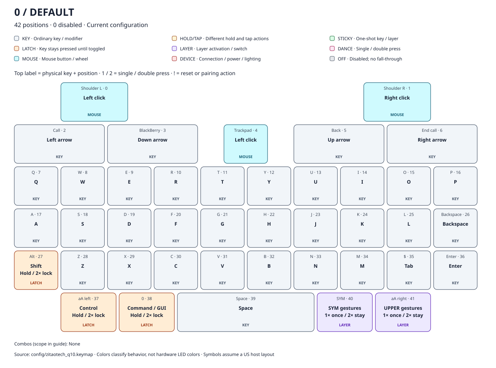
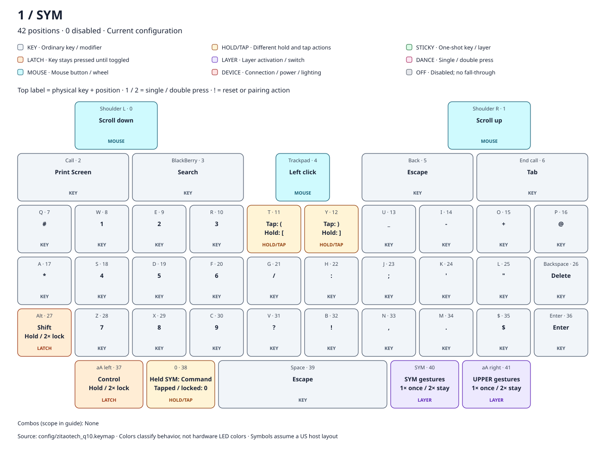
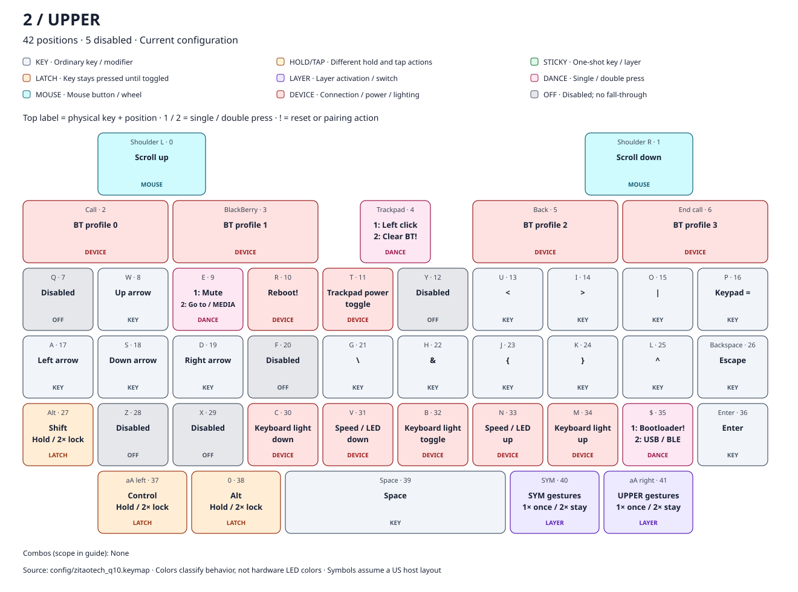
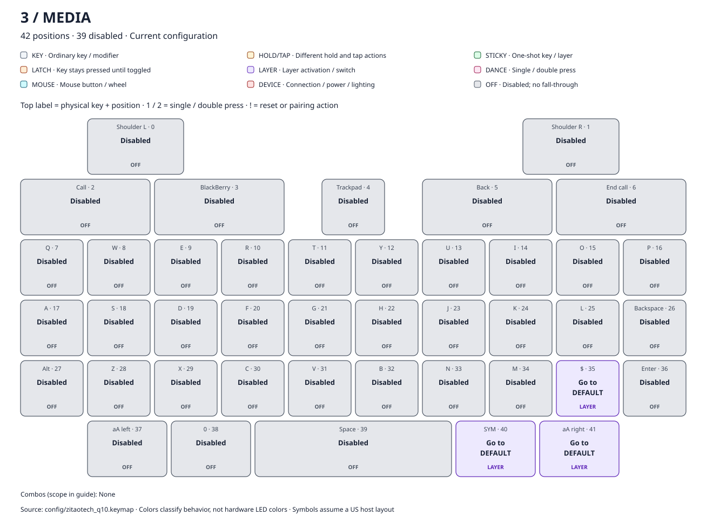

# Current keymaps

Generated from `config/zitaotech_q10.keymap`. Do not edit the generated maps by hand.

[Read the behavior guide](keyboard-guide.md) · [Open the interactive map](keymaps.html)

Positions are zero-based. Physical labels identify the keycap, not its current action. Symbols assume a US host keyboard layout. Color and text badges describe interaction type, not the keyboard's LEDs.

## 0: DEFAULT

42 positions · 0 disabled

| Position | Physical key | Exact binding | Type | Plain-language action |
|---|---|---|---|---|
| 0 | Shoulder L | `&mkp LCLK` | MOUSE | Hold the left mouse button while pressed. |
| 1 | Shoulder R | `&mkp RCLK` | MOUSE | Hold the right mouse button while pressed. |
| 2 | Call | `&kp LEFT` | KEY | Press Left arrow; release when the physical key is released. |
| 3 | BlackBerry | `&kp DOWN_ARROW` | KEY | Press Down arrow; release when the physical key is released. |
| 4 | Trackpad | `&mkp LCLK` | MOUSE | Hold the left mouse button while pressed. |
| 5 | Back | `&kp UP_ARROW` | KEY | Press Up arrow; release when the physical key is released. |
| 6 | End call | `&kp RIGHT_ARROW` | KEY | Press Right arrow; release when the physical key is released. |
| 7 | Q | `&kp Q` | KEY | Press Q; release when the physical key is released. |
| 8 | W | `&kp W` | KEY | Press W; release when the physical key is released. |
| 9 | E | `&kp E` | KEY | Press E; release when the physical key is released. |
| 10 | R | `&kp R` | KEY | Press R; release when the physical key is released. |
| 11 | T | `&kp T` | KEY | Press T; release when the physical key is released. |
| 12 | Y | `&kp Y` | KEY | Press Y; release when the physical key is released. |
| 13 | U | `&kp U` | KEY | Press U; release when the physical key is released. |
| 14 | I | `&kp I` | KEY | Press I; release when the physical key is released. |
| 15 | O | `&kp O` | KEY | Press O; release when the physical key is released. |
| 16 | P | `&kp P` | KEY | Press P; release when the physical key is released. |
| 17 | A | `&kp A` | KEY | Press A; release when the physical key is released. |
| 18 | S | `&kp S` | KEY | Press S; release when the physical key is released. |
| 19 | D | `&kp D` | KEY | Press D; release when the physical key is released. |
| 20 | F | `&kp F` | KEY | Press F; release when the physical key is released. |
| 21 | G | `&kp G` | KEY | Press G; release when the physical key is released. |
| 22 | H | `&kp H` | KEY | Press H; release when the physical key is released. |
| 23 | J | `&kp J` | KEY | Press J; release when the physical key is released. |
| 24 | K | `&kp K` | KEY | Press K; release when the physical key is released. |
| 25 | L | `&kp L` | KEY | Press L; release when the physical key is released. |
| 26 | Backspace | `&kp BSPC` | KEY | Press Backspace; release when the physical key is released. |
| 27 | Alt | `&mod_shift` | LATCH | Press Shift immediately; an ordinary hold ends on release. Double-tap within 250 ms (first press to second press) to lock it across multiple keys. Tap the same modifier again to unlock. Another key or layer change between taps cancels double-tap recognition. Locks can combine and have no unused timeout; they reset on reboot. |
| 28 | Z | `&kp Z` | KEY | Press Z; release when the physical key is released. |
| 29 | X | `&kp X` | KEY | Press X; release when the physical key is released. |
| 30 | C | `&kp C` | KEY | Press C; release when the physical key is released. |
| 31 | V | `&kp V` | KEY | Press V; release when the physical key is released. |
| 32 | B | `&kp B` | KEY | Press B; release when the physical key is released. |
| 33 | N | `&kp N` | KEY | Press N; release when the physical key is released. |
| 34 | M | `&kp M` | KEY | Press M; release when the physical key is released. |
| 35 | $ | `&kp TAB` | KEY | Press Tab; release when the physical key is released. |
| 36 | Enter | `&kp ENTER` | KEY | Press Enter; release when the physical key is released. |
| 37 | aA left | `&mod_ctrl` | LATCH | Press Control immediately; an ordinary hold ends on release. Double-tap within 250 ms (first press to second press) to lock it across multiple keys. Tap the same modifier again to unlock. Another key or layer change between taps cancels double-tap recognition. Locks can combine and have no unused timeout; they reset on reboot. |
| 38 | 0 | `&mod_gui` | LATCH | Press Command / GUI immediately; an ordinary hold ends on release. Double-tap within 250 ms (first press to second press) to lock it across multiple keys. Tap the same modifier again to unlock. Another key or layer change between taps cancels double-tap recognition. Locks can combine and have no unused timeout; they reset on reboot. |
| 39 | Space | `&kp SPACE` | KEY | Press Space; release when the physical key is released. |
| 40 | SYM | `&sym_key` | LAYER | Tap for one use of SYM; hold to use it for the entire chord, then release to exit. Double-tap within 400 ms to lock it; tap again to exit it and its locked child layer. Holding never locks. An unused hold of 400 ms or longer exits on release. A released one-shot expires unused after 3000 ms. Modifiers do not consume it. Another physical key between taps cancels double-tap recognition. |
| 41 | aA right | `&upper_key` | LAYER | Tap for one use of UPPER; hold to use it for the entire chord, then release to exit. Double-tap within 400 ms to lock it; tap again to exit it and its locked child layer. Holding never locks. An unused hold of 400 ms or longer exits on release. A released one-shot expires unused after 3000 ms. Modifiers do not consume it. Another physical key between taps cancels double-tap recognition. |

## 1: SYM

42 positions · 0 disabled

| Position | Physical key | Exact binding | Type | Plain-language action |
|---|---|---|---|---|
| 0 | Shoulder L | `&msc SCRL_DOWN` | MOUSE | Send downward mouse-wheel events while held. |
| 1 | Shoulder R | `&msc SCRL_UP` | MOUSE | Send upward mouse-wheel events while held. |
| 2 | Call | `&kp PSCRN` | KEY | Press Print Screen; release when the physical key is released. |
| 3 | BlackBerry | `&kp C_AC_SEARCH` | KEY | Press Search; release when the physical key is released. |
| 4 | Trackpad | `&mkp LCLK` | MOUSE | Hold the left mouse button while pressed. |
| 5 | Back | `&kp ESC` | KEY | Press Escape; release when the physical key is released. |
| 6 | End call | `&kp TAB` | KEY | Press Tab; release when the physical key is released. |
| 7 | Q | `&kp HASH` | KEY | Press #; release when the physical key is released. |
| 8 | W | `&kp N1` | KEY | Press 1; release when the physical key is released. |
| 9 | E | `&kp N2` | KEY | Press 2; release when the physical key is released. |
| 10 | R | `&kp N3` | KEY | Press 3; release when the physical key is released. |
| 11 | T | `&mt LBKT LPAR` | HOLD/TAP | Tap: Press (; release when the physical key is released. Hold: Press [; release when the physical key is released. Threshold: 200 ms; flavor: hold-preferred. |
| 12 | Y | `&mt RBKT RPAR` | HOLD/TAP | Tap: Press ); release when the physical key is released. Hold: Press ]; release when the physical key is released. Threshold: 200 ms; flavor: hold-preferred. |
| 13 | U | `&kp UNDER` | KEY | Press _; release when the physical key is released. |
| 14 | I | `&kp MINUS` | KEY | Press -; release when the physical key is released. |
| 15 | O | `&kp PLUS` | KEY | Press +; release when the physical key is released. |
| 16 | P | `&kp AT` | KEY | Press @; release when the physical key is released. |
| 17 | A | `&kp STAR` | KEY | Press *; release when the physical key is released. |
| 18 | S | `&kp N4` | KEY | Press 4; release when the physical key is released. |
| 19 | D | `&kp N5` | KEY | Press 5; release when the physical key is released. |
| 20 | F | `&kp N6` | KEY | Press 6; release when the physical key is released. |
| 21 | G | `&kp SLASH` | KEY | Press /; release when the physical key is released. |
| 22 | H | `&kp COLON` | KEY | Press :; release when the physical key is released. |
| 23 | J | `&kp SEMI` | KEY | Press ;; release when the physical key is released. |
| 24 | K | `&kp APOS` | KEY | Press '; release when the physical key is released. |
| 25 | L | `&kp DQT` | KEY | Press "; release when the physical key is released. |
| 26 | Backspace | `&kp DEL` | KEY | Press Delete; release when the physical key is released. |
| 27 | Alt | `&mod_shift` | LATCH | Press Shift immediately; an ordinary hold ends on release. Double-tap within 250 ms (first press to second press) to lock it across multiple keys. Tap the same modifier again to unlock. Another key or layer change between taps cancels double-tap recognition. Locks can combine and have no unused timeout; they reset on reboot. |
| 28 | Z | `&kp N7` | KEY | Press 7; release when the physical key is released. |
| 29 | X | `&kp N8` | KEY | Press 8; release when the physical key is released. |
| 30 | C | `&kp N9` | KEY | Press 9; release when the physical key is released. |
| 31 | V | `&kp QMARK` | KEY | Press ?; release when the physical key is released. |
| 32 | B | `&kp EXCL` | KEY | Press !; release when the physical key is released. |
| 33 | N | `&kp COMMA` | KEY | Press ,; release when the physical key is released. |
| 34 | M | `&kp DOT` | KEY | Press .; release when the physical key is released. |
| 35 | $ | `&kp DLLR` | KEY | Press $; release when the physical key is released. |
| 36 | Enter | `&kp ENTER` | KEY | Press Enter; release when the physical key is released. |
| 37 | aA left | `&mod_ctrl` | LATCH | Press Control immediately; an ordinary hold ends on release. Double-tap within 250 ms (first press to second press) to lock it across multiple keys. Tap the same modifier again to unlock. Another key or layer change between taps cancels double-tap recognition. Locks can combine and have no unused timeout; they reset on reboot. |
| 38 | 0 | `&sym_command` | HOLD/TAP | While SYM is physically held: Press Command / GUI immediately; an ordinary hold ends on release. Double-tap within 250 ms (first press to second press) to lock it across multiple keys. Tap the same modifier again to unlock. Another key or layer change between taps cancels double-tap recognition. Locks can combine and have no unused timeout; they reset on reboot. With a released one-shot or locked SYM: Press 0; release when the physical key is released. The selected action receives its matching release even if the layer ends first. |
| 39 | Space | `&kp ESC` | KEY | Press Escape; release when the physical key is released. |
| 40 | SYM | `&sym_key` | LAYER | Tap for one use of SYM; hold to use it for the entire chord, then release to exit. Double-tap within 400 ms to lock it; tap again to exit it and its locked child layer. Holding never locks. An unused hold of 400 ms or longer exits on release. A released one-shot expires unused after 3000 ms. Modifiers do not consume it. Another physical key between taps cancels double-tap recognition. |
| 41 | aA right | `&upper_key` | LAYER | Tap for one use of UPPER; hold to use it for the entire chord, then release to exit. Double-tap within 400 ms to lock it; tap again to exit it and its locked child layer. Holding never locks. An unused hold of 400 ms or longer exits on release. A released one-shot expires unused after 3000 ms. Modifiers do not consume it. Another physical key between taps cancels double-tap recognition. |

## 2: UPPER

42 positions · 5 disabled

| Position | Physical key | Exact binding | Type | Plain-language action |
|---|---|---|---|---|
| 0 | Shoulder L | `&msc SCRL_UP` | MOUSE | Send upward mouse-wheel events while held. |
| 1 | Shoulder R | `&msc SCRL_DOWN` | MOUSE | Send downward mouse-wheel events while held. |
| 2 | Call | `&bt BT_SEL 0` | DEVICE | Select zero-based Bluetooth profile 0; an unpaired profile is available for pairing. |
| 3 | BlackBerry | `&bt BT_SEL 1` | DEVICE | Select zero-based Bluetooth profile 1; an unpaired profile is available for pairing. |
| 4 | Trackpad | `&td0` | DANCE | 1 press(es): Hold the left mouse button while pressed. 2 press(es): Erase the selected Bluetooth profile pairing. Dance interval: 400 ms. |
| 5 | Back | `&bt BT_SEL 2` | DEVICE | Select zero-based Bluetooth profile 2; an unpaired profile is available for pairing. |
| 6 | End call | `&bt BT_SEL 3` | DEVICE | Select zero-based Bluetooth profile 3; an unpaired profile is available for pairing. |
| 7 | Q | `&none` | OFF | No action; blocks the corresponding lower-layer key. |
| 8 | W | `&kp UP` | KEY | Press Up arrow; release when the physical key is released. |
| 9 | E | `&tdc_to_MEDIA` | DANCE | 1 press(es): Press Mute; release when the physical key is released. 2 press(es): Switch to MEDIA; clear other nondefault layers. Releasing this key does not undo the switch. Dance interval: 400 ms. |
| 10 | R | `&sys_reset` | DEVICE | Restart firmware; do not erase settings. |
| 11 | T | `&ext_power EP_TOG` | DEVICE | Toggle external power used for trackpad on/off according to the manufacturer. |
| 12 | Y | `&none` | OFF | No action; blocks the corresponding lower-layer key. |
| 13 | U | `&kp LT` | KEY | Press <; release when the physical key is released. |
| 14 | I | `&kp GT` | KEY | Press >; release when the physical key is released. |
| 15 | O | `&kp PIPE` | KEY | Press &#124;; release when the physical key is released. |
| 16 | P | `&kp KP_EQUAL` | KEY | Press Keypad =; release when the physical key is released. |
| 17 | A | `&kp LEFT` | KEY | Press Left arrow; release when the physical key is released. |
| 18 | S | `&kp DOWN` | KEY | Press Down arrow; release when the physical key is released. |
| 19 | D | `&kp RIGHT` | KEY | Press Right arrow; release when the physical key is released. |
| 20 | F | `&none` | OFF | No action; blocks the corresponding lower-layer key. |
| 21 | G | `&kp BSLH` | KEY | Press &#92;; release when the physical key is released. |
| 22 | H | `&kp AMPS` | KEY | Press &; release when the physical key is released. |
| 23 | J | `&kp LBRC` | KEY | Press {; release when the physical key is released. |
| 24 | K | `&kp RBRC` | KEY | Press }; release when the physical key is released. |
| 25 | L | `&kp CARET` | KEY | Press ^; release when the physical key is released. |
| 26 | Backspace | `&kp ESC` | KEY | Press Escape; release when the physical key is released. |
| 27 | Alt | `&mod_shift` | LATCH | Press Shift immediately; an ordinary hold ends on release. Double-tap within 250 ms (first press to second press) to lock it across multiple keys. Tap the same modifier again to unlock. Another key or layer change between taps cancels double-tap recognition. Locks can combine and have no unused timeout; they reset on reboot. |
| 28 | Z | `&none` | OFF | No action; blocks the corresponding lower-layer key. |
| 29 | X | `&none` | OFF | No action; blocks the corresponding lower-layer key. |
| 30 | C | `&rgb_ug RGB_BRD` | DEVICE | Decrease RGB brightness used by the custom keyboard-light driver. |
| 31 | V | `&bl BL_DEC` | DEVICE | Decrease backlight by 10; custom trackpad indicator and pointer speed use it. |
| 32 | B | `&rgb_ug RGB_TOG` | DEVICE | Toggle RGB state used by the custom keyboard-light driver. |
| 33 | N | `&bl BL_INC` | DEVICE | Increase backlight by 10; custom trackpad indicator and pointer speed use it. |
| 34 | M | `&rgb_ug RGB_BRI` | DEVICE | Increase RGB brightness used by the custom keyboard-light driver. |
| 35 | $ | `&td_boot_out` | DANCE | 1 press(es): Enter the bootloader for firmware flashing. 2 press(es): Toggle preferred USB/Bluetooth output. Dance interval: 400 ms. |
| 36 | Enter | `&kp ENTER` | KEY | Press Enter; release when the physical key is released. |
| 37 | aA left | `&mod_ctrl` | LATCH | Press Control immediately; an ordinary hold ends on release. Double-tap within 250 ms (first press to second press) to lock it across multiple keys. Tap the same modifier again to unlock. Another key or layer change between taps cancels double-tap recognition. Locks can combine and have no unused timeout; they reset on reboot. |
| 38 | 0 | `&mod_alt` | LATCH | Press Alt immediately; an ordinary hold ends on release. Double-tap within 250 ms (first press to second press) to lock it across multiple keys. Tap the same modifier again to unlock. Another key or layer change between taps cancels double-tap recognition. Locks can combine and have no unused timeout; they reset on reboot. |
| 39 | Space | `&kp SPACE` | KEY | Press Space; release when the physical key is released. |
| 40 | SYM | `&sym_key` | LAYER | Tap for one use of SYM; hold to use it for the entire chord, then release to exit. Double-tap within 400 ms to lock it; tap again to exit it and its locked child layer. Holding never locks. An unused hold of 400 ms or longer exits on release. A released one-shot expires unused after 3000 ms. Modifiers do not consume it. Another physical key between taps cancels double-tap recognition. |
| 41 | aA right | `&upper_key` | LAYER | Tap for one use of UPPER; hold to use it for the entire chord, then release to exit. Double-tap within 400 ms to lock it; tap again to exit it and its locked child layer. Holding never locks. An unused hold of 400 ms or longer exits on release. A released one-shot expires unused after 3000 ms. Modifiers do not consume it. Another physical key between taps cancels double-tap recognition. |

## 3: MEDIA

42 positions · 39 disabled

| Position | Physical key | Exact binding | Type | Plain-language action |
|---|---|---|---|---|
| 0 | Shoulder L | `&none` | OFF | No action; blocks the corresponding lower-layer key. |
| 1 | Shoulder R | `&none` | OFF | No action; blocks the corresponding lower-layer key. |
| 2 | Call | `&none` | OFF | No action; blocks the corresponding lower-layer key. |
| 3 | BlackBerry | `&none` | OFF | No action; blocks the corresponding lower-layer key. |
| 4 | Trackpad | `&none` | OFF | No action; blocks the corresponding lower-layer key. |
| 5 | Back | `&none` | OFF | No action; blocks the corresponding lower-layer key. |
| 6 | End call | `&none` | OFF | No action; blocks the corresponding lower-layer key. |
| 7 | Q | `&none` | OFF | No action; blocks the corresponding lower-layer key. |
| 8 | W | `&none` | OFF | No action; blocks the corresponding lower-layer key. |
| 9 | E | `&none` | OFF | No action; blocks the corresponding lower-layer key. |
| 10 | R | `&none` | OFF | No action; blocks the corresponding lower-layer key. |
| 11 | T | `&none` | OFF | No action; blocks the corresponding lower-layer key. |
| 12 | Y | `&none` | OFF | No action; blocks the corresponding lower-layer key. |
| 13 | U | `&none` | OFF | No action; blocks the corresponding lower-layer key. |
| 14 | I | `&none` | OFF | No action; blocks the corresponding lower-layer key. |
| 15 | O | `&none` | OFF | No action; blocks the corresponding lower-layer key. |
| 16 | P | `&none` | OFF | No action; blocks the corresponding lower-layer key. |
| 17 | A | `&none` | OFF | No action; blocks the corresponding lower-layer key. |
| 18 | S | `&none` | OFF | No action; blocks the corresponding lower-layer key. |
| 19 | D | `&none` | OFF | No action; blocks the corresponding lower-layer key. |
| 20 | F | `&none` | OFF | No action; blocks the corresponding lower-layer key. |
| 21 | G | `&none` | OFF | No action; blocks the corresponding lower-layer key. |
| 22 | H | `&none` | OFF | No action; blocks the corresponding lower-layer key. |
| 23 | J | `&none` | OFF | No action; blocks the corresponding lower-layer key. |
| 24 | K | `&none` | OFF | No action; blocks the corresponding lower-layer key. |
| 25 | L | `&none` | OFF | No action; blocks the corresponding lower-layer key. |
| 26 | Backspace | `&none` | OFF | No action; blocks the corresponding lower-layer key. |
| 27 | Alt | `&none` | OFF | No action; blocks the corresponding lower-layer key. |
| 28 | Z | `&none` | OFF | No action; blocks the corresponding lower-layer key. |
| 29 | X | `&none` | OFF | No action; blocks the corresponding lower-layer key. |
| 30 | C | `&none` | OFF | No action; blocks the corresponding lower-layer key. |
| 31 | V | `&none` | OFF | No action; blocks the corresponding lower-layer key. |
| 32 | B | `&none` | OFF | No action; blocks the corresponding lower-layer key. |
| 33 | N | `&none` | OFF | No action; blocks the corresponding lower-layer key. |
| 34 | M | `&none` | OFF | No action; blocks the corresponding lower-layer key. |
| 35 | $ | `&to DEFAULT` | LAYER | Switch to DEFAULT; clear other nondefault layers. Releasing this key does not undo the switch. |
| 36 | Enter | `&none` | OFF | No action; blocks the corresponding lower-layer key. |
| 37 | aA left | `&none` | OFF | No action; blocks the corresponding lower-layer key. |
| 38 | 0 | `&none` | OFF | No action; blocks the corresponding lower-layer key. |
| 39 | Space | `&none` | OFF | No action; blocks the corresponding lower-layer key. |
| 40 | SYM | `&to DEFAULT` | LAYER | Switch to DEFAULT; clear other nondefault layers. Releasing this key does not undo the switch. |
| 41 | aA right | `&to DEFAULT` | LAYER | Switch to DEFAULT; clear other nondefault layers. Releasing this key does not undo the switch. |
